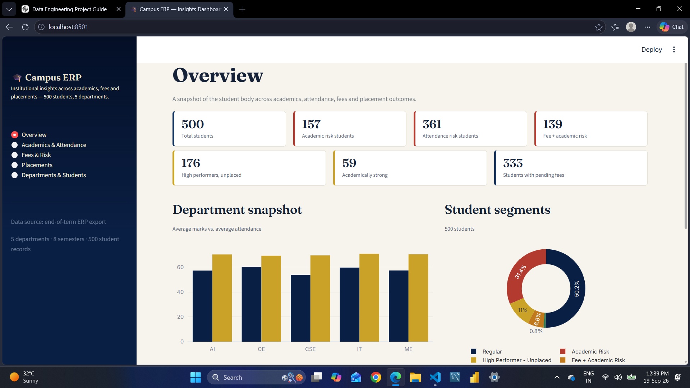

# College ERP Analytics Platform

An end-to-end **Data Engineering and Analytics Platform** that simulates and analyzes academic and administrative data of a college.

The project covers the complete workflow from **data generation → database → cloud data lake → data processing → analytics → dashboard**.

## Architecture

```text
Python
   ↓
CSV Datasets
   ↓
MySQL
   ↓
Azure Data Lake Storage Gen2
   ↓
Azure Data Factory
   ↓
Processed Data
   ↓
Databricks Free Edition + PySpark
   ↓
Delta Lake
   ↓
Analytical Datasets
   ↓
Streamlit Dashboard
```

## Tech Stack

- Python
- MySQL
- SQL
- Azure Data Lake Storage Gen2
- Azure Data Factory
- PySpark
- Databricks Free Edition
- Delta Lake
- Streamlit
- Pandas
- Plotly
- Git & GitHub

## Datasets

The project works with seven College ERP datasets:

- Students
- Faculty
- Subjects
- Attendance
- Results
- Fees
- Placements

The datasets are generated using Python and stored in MySQL for relational analysis.

## Cloud Data Engineering

Azure is used for cloud storage and data movement.

**Azure Data Lake Storage Gen2**

```text
Storage Account: collegeerpdata2026
Containers: raw, processed
```

**Azure Data Factory**

```text
Data Factory: collegeerp-adf-2026
Pipeline: PL_Copy_Raw_Data
```

The ADF pipeline moves CSV files from the **Raw** layer to the **Processed** layer.

## Data Processing & Analytics

PySpark is used to transform the ERP datasets and create a unified student-level analytical dataset.

Databricks Free Edition is used for Spark and SQL-based analytics.

Main Delta table:

```text
collegeerp_student_analytics
```

The analytical dataset contains:

```text
500 students
14 analytical columns
```

## Key Insights

| Metric | Result |
|---|---:|
| Total Students | 500 |
| Average Attendance | 70.12% |
| Average Marks | 57.58 |
| Students Below 75% Attendance | 361 |
| Students Below 50 Marks | 210 |
| Placed Students | 27 |
| Placement Rate | 5.40% |
| Average Package | 9.05 LPA |
| Highest Package | 14.48 LPA |
| Total Fees Collected | 20,488,115 |
| Total Pending Fees | 17,011,885 |

## Streamlit Dashboard

The project includes an interactive Streamlit dashboard for exploring:

- Overall KPIs
- Academics & Attendance
- Fees & Risk
- Placements
- Departments
- Student-level insights
- Recruiter and package analysis

### Dashboard Preview



### Run the Dashboard

```bash
cd dashboard
pip install -r requirements.txt
streamlit run app.py
```

The dashboard runs locally at:

```text
http://localhost:8501
```

## Project Structure

```text
college-erp-data-platform/
│
├── azure/
├── dashboard/
│   ├── app.py
│   ├── requirements.txt
│   └── data/
│
├── data/
├── data_generator/
├── database/
├── docs/
├── pyspark/
├── screenshots/
│   └── dashboard_overview.png
│
├── README.md
└── requirements.txt
```

## Documentation

Detailed project documentation covering datasets, MySQL, Azure, ADF, PySpark, Databricks, Delta Lake, KPIs, analytical insights and dashboard implementation is available in:

```text
docs/project_documentation.md
```

## Project Status

- ✅ Python Data Generation
- ✅ MySQL Database
- ✅ SQL Analysis
- ✅ Azure ADLS Gen2
- ✅ Azure Data Factory
- ✅ PySpark Transformations
- ✅ Databricks Free Edition
- ✅ Delta Lake
- ✅ Analytical Datasets
- ✅ KPI & Insight Generation
- ✅ Streamlit Dashboard
- ✅ Git & GitHub

## Author

**Avantika Chouhan**

GitHub:  
https://github.com/AvantikaChouhan/college-erp-data-platform

## License

This project is created for educational and portfolio purposes.